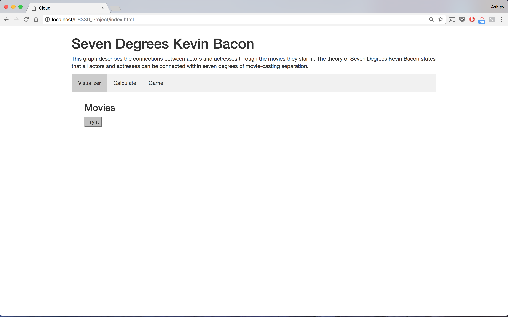
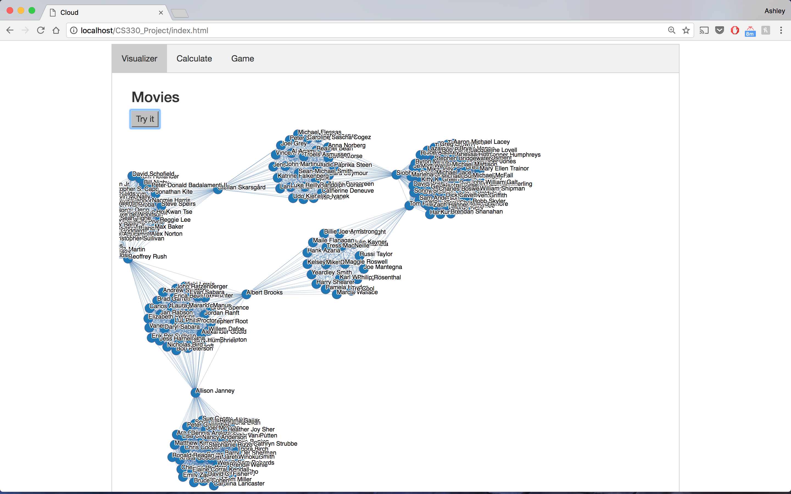
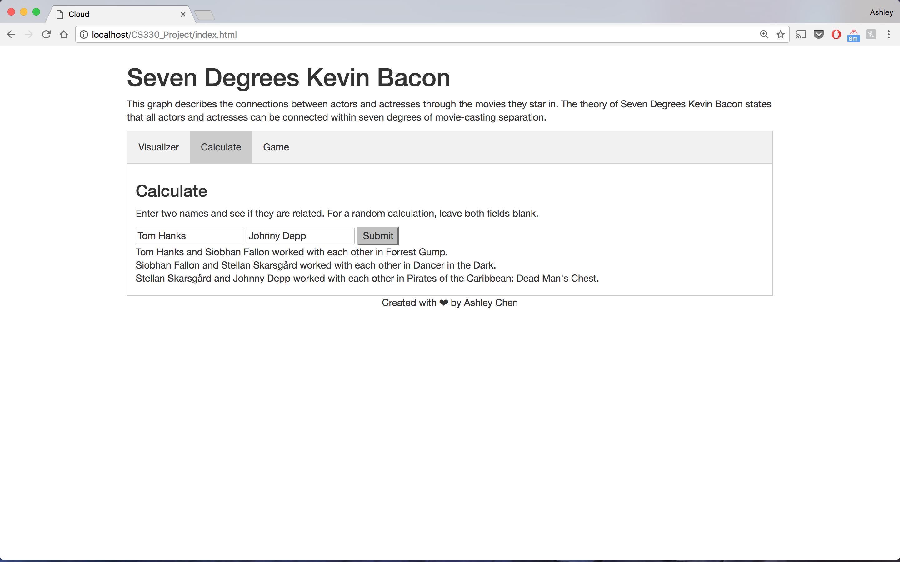
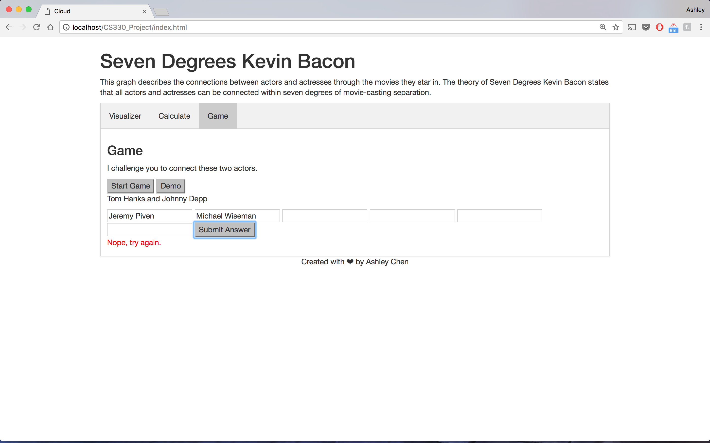

# Seven Degrees Kevin Bacon

### Play the game of Seven Degrees Kevin Bacon by guessing how actors are connected to each other in less than seven degrees.

**Documentation**
* [Final Project](http://sevenkevinbacon.herokuapp.com/)
* [Presentation](https://docs.google.com/a/simmons.edu/presentation/d/1-oX9qbZaCCJ7wCDsBV6vCMOJJMVf0P2vGvzCVy_wTbU/edit?usp=sharing)
* [Write-Up](Documentation/writeup.pdf)
* [Screenshots](Documentation/)
* [Demo Video](Documentation/Demo.mov)

**How to open website on localhost**
* Make sure to clone your repo into htdocs and start your Apache Server.
* I used Google Chrome as my browser. If modifications are made to repo, make sure to clear your cache before execution.
* Collection of MovieDB API calls are stored using Sublime Text output console save.

### Screenshots

